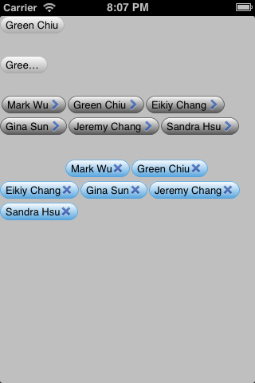
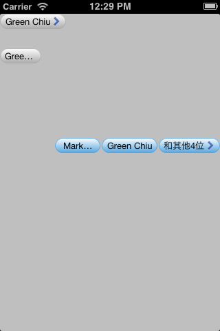

GCTagList
=========

GCTagList like iOS Mail app's sender or recivers tags.

 


##Installation

#### before v1.3.1  

Simple copy over the `classes` folder and `assets` folder into your project and make sure you have linked the framework `QuartzCore.framework`, and import the `GCTagList.h`.

#### v1.3.1

###Cocoapods

use GCTagList with Cocoapods

```
pod 'GCTagList', '~> 1.3'
```

##What's new 


> I split up the class to three parts, `GCTagList`、`GCTagLabel` and `UIColor+Uitiles` with v1.3.1; I hope this way could more easy to read and maintain.


* custom font for TagList, use the property `labelFont` with __GCTagList__.
* support xib. [after v1.2]
* you can custom the label's gradient colors and color locations. [after v1.1]


```Objective-C

/**
 * labelBackgroundColor's Priority > gradientColors,
 * if labelBackgroundColor and gradientColors all nil, 
 * will use default color #E0EAF4
 */
@property (nonatomic, GC_STRONG) UIColor *labelBackgroundColor;

/**
 * if gradientColors's count is less 2, will use default labelBackgroundColor;
 */
@property (nonatomic, GC_STRONG) NSArray *gradientColors; ///< ...
@property (nonatomic, GC_STRONG) NSArray *gradientLocations; ///< can be nil …
```

## Features

* custom the label gradient colors and colors locations (for GradientColors) [after] v1.1
* support MaxRow.
* TagLabel could set not show selectedState. (selectedEnabled)
* reload/delete/insert with range.


```Objective-C   
- (void)reloadTagLabelWithRange:(NSRange)range withAnimation:(BOOL)animated;
- (void)deleteTagLabelWithRange:(NSRange)range withAnimation:(BOOL)animated;
- (void)insertTagLabelWithRange:(NSRange)range withAnimation:(BOOL)animated;
```

I try to imitate UITableView's way - @greenchiu

##next version(1.4) will support

* custom accessoryButton.
* more accessoryType for TagLabel.

##Supports

* ARC
* iOS 5.0 ~

##How to use
implementation the GCTagListDataSource and call the public method `reloadData`  

```Objective-C   
-(void)viewDidLoad {
	[super viewDidLoad];
	GCTagList* taglist = [[GCTagList alloc] initWithFrame:CGRectMake(0, 180, 320, 200)];
    taglist.firstRowLeftMargin = 80.f;
    taglist.dataSource = self;
    [self.view addSubview:taglist];
    [taglist reloadData];
}
```

```Objective-C   
- (NSInteger)numberOfTagLabelInTagList:(GCTagList *)tagList {
    return self.tagNames.count;
}

- (GCTagLabel*)tagList:(GCTagList *)tagList tagLabelAtIndex:(NSInteger)index {
    
    static NSString* identifier = @"TagLabelIdentifier";
    
    GCTagLabel* tag = [tagList dequeueReusableTagLabelWithIdentifier:identifier];
    if(!tag) {
        tag = [GCTagLabel tagLabelWithReuseIdentifier:identifier];
        tag.labelBackgroundColor = [UIColor colorWithRed:84/255.f green:164/255.f blue:222/255.f alpha:1.f];
    }
    
    [tag setLabelText:self.tagNames[index]
        accessoryType:GCTagLabelAccessoryCrossFont];
    
    return tag;
}
```


##GCTagListDelegate Protocol

```Objective-C   
/**
 * after reloadData, if the height of TagList has changed, will call this method.
 */
- (void)tagList:(GCTagList *)taglist didChangedHeight:(CGFloat)newHeight;

/**
 * Tapped the TagLabel, will call this mehtod.
 */
- (void)tagList:(GCTagList *)taglist didSelectedLabelAtIndex:(NSInteger)index;

/**
 * Tapped the TagLabel's accessoryButton, will call this mehtod.
 */
- (void)tagList:(GCTagList *)tagList accessoryButtonTappedAtIndex:(NSInteger)index;

/**
 * if implement protocol <GCTagLabelListDataSource> method 'maxNumberOfRowAtTagList' 
 * and the taglist's rows is more than the maxRow, this method will be call.
 * 
 * @retVal NSString the text for the TagLabel of theMaxRow's last one.
 */
- (NSString*)tagList:(GCTagList *)tagList labelTextForGroupTagLabel:(NSInteger)interruptIndex;
```

##GCTagListDataSource Protocol
```Objective-C   
/**
 * how many count for taglist to display.
 */
- (NSInteger)numberOfTagLabelInTagList:(GCTagList*)tagList;

/**
 * the taglabel At index in the taglist.
 */
- (GCTagLabel*)tagList:(GCTagList*)tagList tagLabelAtIndex:(NSInteger)index;

@optional
/**
 * the max row at taglist.
 */
- (NSInteger)maxNumberOfRowAtTagList:(GCTagList*)tagList;

/**
 * accessory type of the group taglabel.
 */
- (GCTagLabelAccessoryType)accessoryTypeForGroupTagLabel;
```

##Reference

* [DWTagList](https://github.com/domness/DWTagList)
* [ColorUtils](https://github.com/nicklockwood/ColorUtils)

##License

Use this control in your apps? Let me know!

Copyright (c) 2013  Green Chiu, http://greenchiu.github.com/ Licensed under the MIT license (http://www.opensource.org/licenses/mit-license.php)

Permission is hereby granted, free of charge, to any person obtaining a copy of this software and associated documentation files (the ‘Software’), to deal in the Software without restriction, including without limitation the rights to use, copy, modify, merge, publish, distribute, sublicense, and/or sell copies of the Software, and to permit persons to whom the Software is furnished to do so, subject to the following conditions:

The above copyright notice and this permission notice shall be included in all copies or substantial portions of the Software.

THE SOFTWARE IS PROVIDED ‘AS IS’, WITHOUT WARRANTY OF ANY KIND, EXPRESS OR IMPLIED, INCLUDING BUT NOT LIMITED TO THE WARRANTIES OF MERCHANTABILITY, FITNESS FOR A PARTICULAR PURPOSE AND NONINFRINGEMENT. IN NO EVENT SHALL THE AUTHORS OR COPYRIGHT HOLDERS BE LIABLE FOR ANY CLAIM, DAMAGES OR OTHER LIABILITY, WHETHER IN AN ACTION OF CONTRACT, TORT OR OTHERWISE, ARISING FROM, OUT OF OR IN CONNECTION WITH THE SOFTWARE OR THE USE OR OTHER DEALINGS IN THE SOFTWARE.
